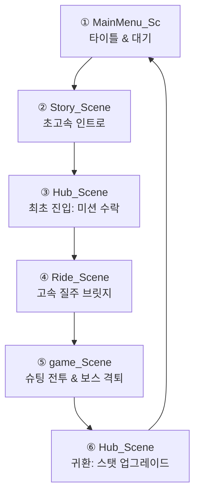

# 🏁 Cyberpunk Hub Scene Development Summary & Roadmap

이 문서는 플레이 엑스포 전시를 위해 구축한 **2.5D 사이버펑크 허브 씬(Hub Scene)**의 개발 완료 사항과 실제 전시용 빌드에서 전개되어야 하는 최적의 씬 흐름 시뮬레이션, 그리고 향후 확장할 수 있는 추가 추천 작업 목록을 정리한 로드맵입니다.

---

## 🛠️ 1. 개발 완료 및 적용 사항 요약

지금까지 완벽히 연동되어 작동 중인 핵심 시스템과 작업 내역입니다.

### ① 2.5D 사이버펑크 비주얼 환경 구축
* **프리미엄 바닥 타일 4종 정리**: `Assets/my assets/Sprites/` 경로에 금속, 철격자, 산업용 노란 사선, 콘크리트 바닥 타일을 정렬했습니다.
* **프로그래밍 방식 천장 타일 4종 생성**: 파이썬 Pillow 픽셀 연산을 이용해 바닥 타일과 완벽히 각도가 대칭되는 쿼터뷰 천장 타일을 제작했습니다. (네온 광선, 오렌지 전열 glow, 비상 사이렌, 산업용 Conduit 배관 포함)
* **시야 가림 방지 페이더 (`CeilingFader.cs`)**: 플레이어가 천장 아래로 들어가면 알파값이 `1.0 ➔ 0.25f`로 부드럽게 감쇄하여 캐릭터 가림 현상을 완전히 해소했습니다.

### ② 정교한 플레이어 이동 및 애니메이션 (`HubPlayerMovement.cs`)
* **직관적인 WASD 상하좌우 이동 (기본값)**: 게임씬과 통일된 조작감을 위해 화면 직관적인 2D 이동을 적용했습니다. (인스펙터의 `useIsometricAxis` 토글로 오리지널 대각선 2.5D 모드 전환 가능)
* **애니메이션 연동**: `Animator` 컴포넌트와 자동 동기화하여 `isMoving`(Bool), `InputX`(Float), `InputY`(Float) 파라미터를 넘겨주어 Idle ➔ Walk 애니메이션 전환을 자동화했습니다.
* **에러 방지 자동화**: 주인공 오브젝트에 `Rigidbody2D`가 없을 시 스크립트가 자동으로 최적화 옵션(중력 0, 회전 방지)과 함께 컴포넌트를 추가합니다.

### ③ 2.5D 쿼터뷰 깊이 정렬 & 물리 경계 (`YSorter.cs`)
* **실시간 Y축 소팅**: 캐릭터와 장애물의 Y좌표 높낮이에 따라 `Sorting Order`를 실시간 조절하여 기둥이나 벽 뒤로 갈 때 앞뒤 관계가 완벽히 그려집니다. (장애물은 최초 1회만 계산하여 모바일/PC 최적화 완료)
* **테두리선 가두기 (`EdgeCollider2D`)**: 수십 개의 투명 벽 대신 맵의 이동 가능 바닥 구역을 `EdgeCollider2D` 선 하나로 둘러싸서 플레이어가 맵 밖으로 떨어지는 버그를 차단했습니다.

### ④ 세이프존 미션 및 업그레이드 순환 루프
* **상호작용 포인트 (`HubInteractionPoint.cs`)**: 차고(F키 ➔ 출격), 홀로그램(F키 ➔ 퀘스트 대화), 작업실(F키 ➔ 업그레이드)을 연동했습니다.
* **홀로그램 퀘스트 수락 및 우측 HUD 연동**: 홀로그램 NPC에게 퀘스트를 받으면 대사 분기점과 함께 우측 화면에 `[진행 중인 임무]` 알림판이 활성화됩니다.
* **업그레이드 스탯 실적용**: `PlayerDataManager`에 기록된 5대 스탯 레벨(이동속도, 최대 에너지, 에너지 회복 속도, 대쉬 효율, 최대 체력)을 인게임 전투 씬(`Player.cs`, `PlayerMoving.cs`)에 대입 완료했습니다.
* **스테이지 클리어 보상 지급**: 전투 씬 보스 격퇴 성공(`LevelController.cs`) 시 자동으로 `20 칩` 재화를 지급하도록 연동하여 루프를 완성했습니다.

---

## 🎮 2. 플레이엑스포(PlayX4) 전시용 최적 빌드 흐름 시뮬레이션

전시관 현장에서 플레이어와 관람객들이 최적의 타이밍에 긴장감과 손맛을 느끼게 설계한 데모 빌드의 씬 전환 흐름(Sequence)입니다.

### ① 대기 및 타이틀 화면: `MainMenu_Sc`
* **역할**: 관람객이 패드를 잡기 전, 부스 앞 디스플레이에 노출되는 대기 화면입니다.
* **비주얼**: 네온사인 가득한 사이버펑크 스타일 로고와 함께 **[데모 시작]** 버튼이 깜빡입니다.
* **동작**: 시작 버튼을 누르면 불필요한 대기 시간 없이 즉시 초고속 세계관 화면으로 전환됩니다.

### ② 초고속 세계관 세팅: `Story_Scene`
* **역할**: 현장의 소음 속에서 유저가 빠르게 게임 설정을 직관적으로 이해하도록 돕습니다.
* **연출**: 어두운 화면에 에러음과 경고등이 켜지며 **단 1줄의 요약 텍스트**가 빠르게 노출됩니다.
  * *"시스템 오염률 98%. 인류의 마지막 코어 파일럿, 세이프존 기지에 접속합니다."*
* **전시 팁**: 텍스트는 3초 뒤에 자동 스킵되거나, 아무 키나 클릭 시 곧바로 2.5D 허브 씬으로 강제 전환되도록 셋업합니다.

### ③ 안전지대 기지 최초 진입: `Hub_Scene` (최초)
* **역할**: 2.5D 쿼터뷰의 세련된 아트 비주얼을 확인하고, 기초적인 이동을 해보는 단계입니다.
* **이벤트**:
  1. 기지 중앙의 **홀로그램 NPC**에게 걸어가 **F키**를 눌러 통신을 연결합니다.
  2. 홀로그램의 대화창 지문을 확인하고 **[미션 수락]** 버튼을 누릅니다. (수락 즉시 우측 화면에 `[임무: 차고에서 1스테이지 출격하기]` 미션 알림판 HUD 활성화)
  3. 왼쪽의 **차고(Garage)** 구역으로 이동해 **F키**를 눌러 **[1스테이지 출격]**을 클릭합니다.

### ④ 속도감 넘치는 전환 연출: `Ride_Scene`
* **역할**: 2.5D 쿼터뷰에서 횡스크롤 액션 씬으로 전환될 때의 이질감을 매끄럽게 채워주는 비주얼 브릿지(Bridge)입니다.
* **연출**: 기지 문이 개방되며 오토바이를 탄 주인공이 화면 밖 감염 세계를 향해 엄청난 가속으로 질주해 날아갑니다. 오토바이가 화면 끝으로 사라지면 페이드아웃 되며 전투가 시작됩니다.

### ⑤ 본격 하이퍼 슈팅 전투: `game_Scene`
* **역할**: 관람객들의 도파민을 터뜨리는 **데모 빌드의 0순위 핵심 스테이지**입니다. (플레이타임: 약 2~3분 내외)
* **경험**:
  * 쏟아지는 벽 장애물을 피하고 붉은 레이저 경고선을 파악하여 대쉬 무적 판정으로 회피합니다.
  * **보스전 피날레**: 생존하며 전투를 지속하면 거대 보스가 소환됩니다. 보스를 파괴하거나 보스의 최종 광폭화 레이저 무작위 난사 패턴을 아슬아슬하게 견뎌내면 화면 중앙에 거대한 **[VICTORY (미션 성공!)]** 스플래시가 터집니다.
  * **전시용 사망 안전장치**: 혹시 난이도가 높아 사망할 경우(`gameOverPanel`), 불필요한 로딩 없이 1초 만에 즉시 부활하게 하거나, 위로금 성격으로 칩 3~5개를 주며 허브 씬으로 귀환시킵니다.

### ⑥ 기지 복귀 및 성장 쾌감: `Hub_Scene` (귀환)
* **역할**: 전투에서의 성과로 기체를 대폭 강화하여 성취감을 부여합니다.
* **동작**:
  1. 기지로 돌아오면 화면 상단에 **`CHIP: 20`** (승리 보상)이 반짝입니다.
  2. 오른쪽 **작업실(Workshop)** 구역으로 가서 **F키**를 누릅니다.
  3. 스탯 강화 창을 열어 이동속도, 에너지, HP 등 원하는 능력치를 마구 클릭해 업그레이드합니다.
  4. 강화된 수치가 `PlayerDataManager`에 영구 적용되며, "데모 완료!" 연출과 함께 다시 타이틀 화면(`MainMenu_Sc`)으로 넘어가 다음 대기자에게 패드를 건네줍니다.

---

## 🚀 3. 앞으로 추가하면 좋은 추천 작업 (로드맵)

전시용 빌드의 퀄리티를 한 차원 더 끌어올리기 위한 추천 추가 작업 마일스톤입니다.

### 1단계: 세이브/로드 시스템 연동 (Save & Load)
* **목표**: 게임을 껐다 켜거나 씬이 완전히 초기화되어도 획득한 칩과 업그레이드 능력치 데이터가 컴퓨터 파일로 영구 저장되도록 연동합니다.
* **세부 내용**: `PlayerDataManager.cs`에 유니티 `PlayerPrefs` 또는 JSON 직렬화를 사용하여 강화 단계와 보유 칩 개수를 디스크에 로컬 저장하고 로드하는 함수를 작성합니다.

### 2단계: 오토바이 이동 씬 (`Ride_Scene`) 조작 및 흐름 다듬기
* **목표**: 차고에서 출격할 때 오토바이 씬으로 넘어가 전투 씬으로 자연스럽게 전환되도록 연출을 다듬습니다.
* **세부 내용**: 오토바이를 운전해 세이프존을 탈출하는 전용 조작 스크립트를 보완하고, 일정 거리를 달리면 자연스럽게 본 게임 씬(`game_Scene`)으로 화면 페이드 전환되도록 연동합니다.

### 3단계: 홀로그램 연출 및 스팀 파티클 효과 (VFX)
* **목표**: 사이버펑크 느낌을 극대화하기 위해 허브 씬에 비주얼 파티클과 셰이더 효과를 입힙니다.
* **세부 내용**:
  * 홀로그램 기둥에 위아래로 움직이는 줄무늬와 미세한 깜빡임(Glitch) 효과를 셰이더나 스크립트로 추가합니다.
  * 천장 배관 Conduit 파이프 밸브나 바닥 격자 틈새에서 은은하게 뿜어져 나오는 **2D 스팀(증기) 파티클 효과**를 유니티 Particle System으로 추가합니다.

### 4단계: 다단계 미션 및 NPC 다양화
* **목표**: 유저가 1스테이지 외에도 순차적으로 미션을 진행할 수 있도록 확장합니다.
* **세부 내용**: 
  * 1스테이지 클리어 시 홀로그램 NPC가 다음 "감염 구역 스테이지 2" 미션을 부여하도록 `PlayerDataManager.currentStage` 값과 매칭되는 퀘스트 다이얼로그 시스템을 구축합니다.
  * 작업실에 공구를 만지작거리는 작은 정비 드로이드(Robot)를 NPC로 추가해 기계음 사운드와 함께 생동감을 더합니다.

---

> [!TIP]
> **현재 유니티 에디터 상에서 가장 먼저 해야 할 일!**
> 1. 주인공의 발밑에 `Circle Collider 2D` (Is Trigger 해제)가 있는지 확인해 주세요.
> 2. `WalkableBoundary` 오브젝트의 `Edge Collider 2D`에 `Is Trigger`가 해제되어 있는지 점검하여 맵 가두기를 작동시킵니다.
